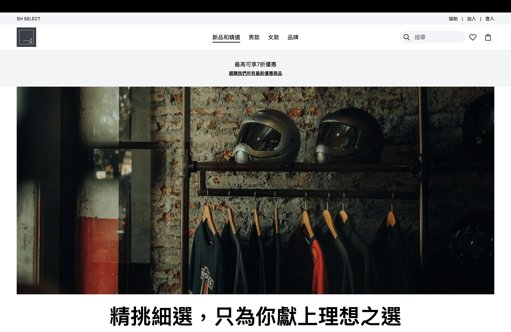

# SH SELECT 電商網站

 

本專案網址 (GitHub page)：https://qqpp0504.github.io/sh-select-project

SH SELECT 是一個電商網站作品，整體復刻自 [**Nike**](https://www.nike.com/tw/) 官方網站。不同於 Nike 官網，本作品網站為服飾選貨為主題，選自各大知名潮流品牌之服飾產品來進行商品展示。用戶可以輕鬆完成購物流程，享受高效的購物體驗。

💭 由於我很喜歡極簡風格，簡約卻讓使用者一目瞭然，最重要的是功能齊全又能讓使用者有流暢的體驗，是我最喜歡的網站風格，故選擇 Nike 作為復刻參考。

 

## 功能展示

- **極簡化設計**：復刻 Nike 官方網站，提供直觀的用戶界面和流暢的瀏覽體驗。

- **響應式設計**：支持桌面、平板和手機設備，無論在哪個設備上，都能提供良好的用戶體驗。

- **商品展示**：展示多種類型的運動鞋、服裝和配件，每一件商品都有詳細的圖片和描述。

- **購物車功能**：用戶可以輕鬆添加商品至購物車，並隨時檢視和管理選中的商品。

- **結帳流程**：簡單明了的結帳頁面，良好的提示輸入表單提升用戶體驗。

- **登入與註冊**：提供簡單易用的登入和註冊功能，使用者可以創建帳號並登入後，使用將商品加入最愛、瀏覽最愛，與察看個人資訊、訂單功能。

 

## 使用之技能

### 前端技術

1. **HTML5**  
   使用語意化的 HTML 標籤來結構化網頁內容，使網頁架構更清晰、易於理解。

2. **CSS3 & Tailwind CSS**  
   使用 Tailwind CSS 作為主要的樣式框架，並配合原生 CSS 進行便利且快速的樣式設計。

3. **JavaScript (ES6+)**  
   使用現代 JavaScript 功能（如解構賦值、async/await）來處理前端邏輯。

4. **React**  
   使用 React 開發組件化的 UI，提升開發效率並實現動態內容渲染。  
   使用 React Router 進行頁面導航，讓用戶體驗更加流暢。

5. **Redux**  
   用於管理全局狀態，特別是在處理購物車狀態與彈跳各種 Modal 時提供一致的數據流。

6. **TanStack Query / React Query**  
   用來進行 API 數據請求與狀態管理，簡化數據抓取邏輯。

7. **Lazy Loading (懶加載)**  
   使用懶加載技術，通過動態加載頁面內容或組件，只有在用戶需要查看時才加載，從而提高頁面的加載速度和性能。

### 後端技術

使用 Node.js 搭配 Express 框架來構建伺服器，以及使用後端 JSON 檔案存放應用所需資料，作為輕量級的資料庫。

💭 本專案的後端部分主要由 **ChatGPT** 協助生成，感謝他的偉大！

 

## 開發工具與部署

使用 Vite 作為構建工具。
透過 Github、Render 平台進行前後端部署。

⚠️ 由於 Render 平台的免費方案有冷啟動（Cold Start）問題，也就是伺服器會進入休眠狀態，當有請求時才會重新啟動，可能會導致首次加載變慢，故進入網站可能要耐心等待數秒時間加載資訊。

 

## 測試登入帳號

本專案提供之測試帳號如下，供大家進行登入流程、加入最愛與查看會員資料訂單等功能。

信箱：test@gmail.com  
密碼：Test1234

 

## 尚未完成與注意事項

此專案有尚未完成之功能/頁面如下，如點選會導向**首頁頁面**：

- 頁尾之 **傳送意見回饋** 頁面

- **會員結帳** 頁面功能尚未設計，故會與訪客結帳頁面相同

- **會員福利** 之優惠功能尚未設計，故下單無法享有折扣優惠

- **訪客與會員結帳** 頁面，信用卡表單刻意設定為無法填寫的輸入，避免有人真的填寫真實資訊

⚠️ 本專案僅供作品集之展示用途，故請勿下單，如要下單測試，請填寫虛假資料以保護個資。
